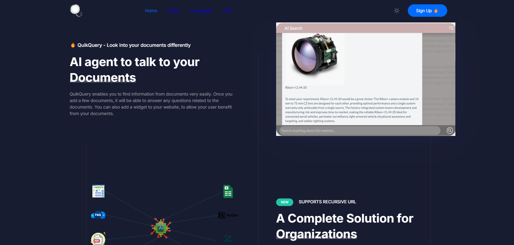

QuikQuery enables you to find information from documents very easily. Once you add a few documents, it will be able to answer any questions related to the documents. You can also add a widget to your website, to allow your user benefit from your documents.

##  Supports Recursive URL

QuikQuery supports many different types of documents including websites, pdf, docx, xlsx, csv and many more.

## Languages

QuikQuery allows you to train your data in one language but answer in multiple languages, without any extra effort!

## Frequently AskedQuestions

### What is QuikQuery?

QuikQuery is an AI supported search assistant. Once feed with the docs, it can answer to users questions. You can easily integrate with your website with a very simple line of script

### How do I train my search agent?

To properly train your agent, you need to furnish it with essential documents, FAQs, website links, and other pertinent data. Utilizing this information, the agent will enhance its responses progressively.

### &#xA;Will I see the search history?

Yes, you can view the search history in the dashboard. It allows you to see how well your documentation is writen and how it benefits the user. Also it allows you to see there is topic that is not covered and user did not find answer to a question.