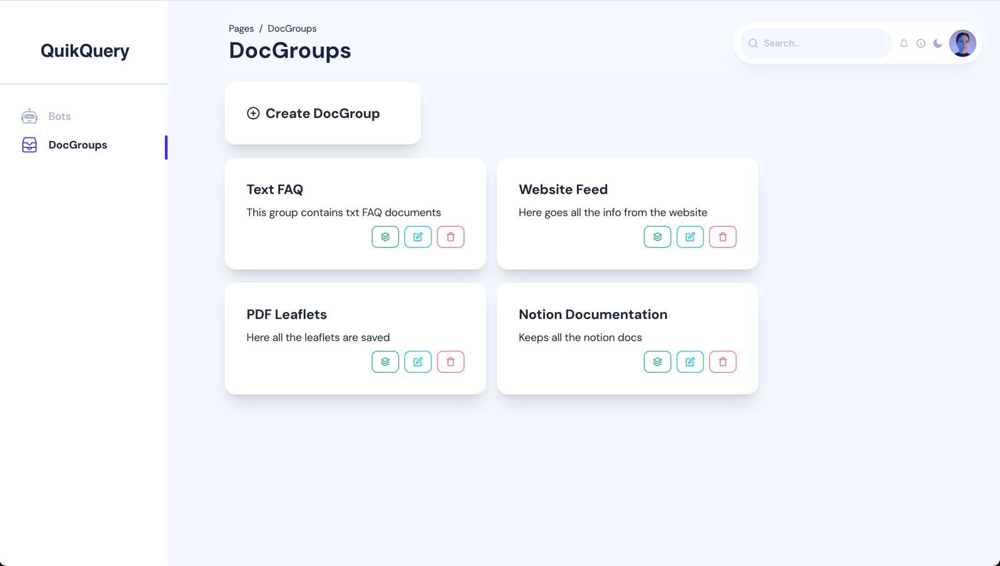
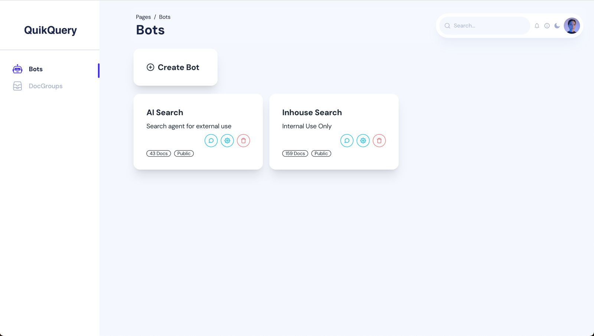
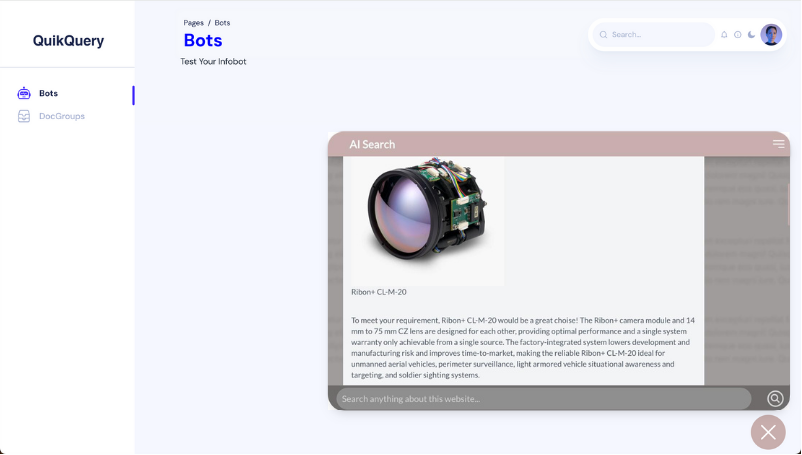

## Start by adding your documents

QuikQuery supports many document types like website, docs, excel, csv, pdf and many more. You can add your desired documents within a few clicks.

You can also add documents group which allows you keep your resources organized.

## Easily create a search agent

Just like adding documents, creating agent is also very simple. The only external thing it requires is an openai API key, which is also very easy to get.

As soon as you create the bot, your bot will be up and running!

## Assign docs and you agent is up

You can easily assign documents groups to your agent. And immediately it will be able to answer based on the provided documents.

You can add the bot to your website by adding a simple script.

